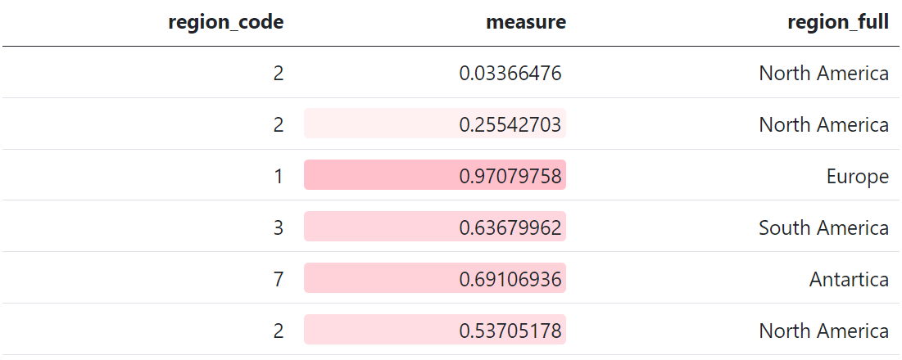

Mapping SAS Formats to R, Part 2
================
Michael Walshe

# Picking Up From Last Time

Last time, we introduced the SAS format and looked at methods for
replicating two aspects of it’s functionality in R, specifically
performing a lookup and grouping data. Today, we’ll investigate how to:

- Apply a ‘mask’ to data. This means that you can change the way that
  data is displayed, without changing the underlying data (e.g. a value
  of `-0.6534` could print as `(65.3%)`)
- Read formatted data as a different type, for example to read a value
  of `"£1,000.00"` in a CSV as `1000`.

# Masks

Using a format as a “mask” for data is the most common use-case in SAS,
keeping the underlying data the same but applying formatting when it is
displayed. There are a number of methods we can use to replicate this in
R.

## Method 1: Base R

Using Base R, there are several different functions that can format
data.

The first we’ll use is the `format()` function, which can format any R
object for printing, but is typically used for numeric vectors and has a
large set of options:

``` r
numbers <- runif(10, -1000000, 1000000)

format(numbers, justify="right", width="10", big.mark=",") |> print()
```

    #>  [1] "-424,844.96" " 576,610.27" "-182,046.16" " 766,034.81" " 880,934.57"
    #>  [6] "-908,887.00" "  56,210.98" " 784,838.09" " 102,870.03" " -86,770.53"

``` r
format(numbers, digits=3, scientific=TRUE) |> print()
```

    #>  [1] "-4.25e+05" " 5.77e+05" "-1.82e+05" " 7.66e+05" " 8.81e+05" "-9.09e+05"
    #>  [7] " 5.62e+04" " 7.85e+05" " 1.03e+05" "-8.68e+04"

Alternatively, the `sprintf` function provides a familiar interface to
those used to C style formatting, for more detail run `?sprintf`.

``` r
sprintf("$%.2f", numbers)
```

    #>  [1] "$-424844.96" "$576610.27"  "$-182046.16" "$766034.81"  "$880934.57" 
    #>  [6] "$-908887.00" "$56210.98"   "$784838.09"  "$102870.03"  "$-86770.53"

## Method 2: [`{scales}`](https://scales.r-lib.org/)

The `{scales}` package is used by `{ggplot2}` to scale data for graphs,
but it also includes some useful formatting functions that can help with
common formats. For example:

``` r
scales::label_dollar(prefix="£", style_negative="parens")(numbers)
```

    #>  [1] "(£424,845)" "£576,610"   "(£182,046)" "£766,035"   "£880,935"  
    #>  [6] "(£908,887)" "£56,211"    "£784,838"   "£102,870"   "(£86,771)"

Note that all the `scale::label_...` functions return another function,
and we’ve passed the `numbers` vector into this. There are label
functions for currency, percents, dates, time, mathematics, SI units,
p-values, and more! If a particular label is used frequently in your
code, it may be helpful to assign it to a helper function

``` r
percent <- scales::label_percent(
  accuracy=0.1,
  suffix=" %",
  decimal.mark=",",
  style_negative="parens"
)

percent(runif(5, -1, 1))
```

    #> [1] "91,4 %"   "(9,3 %)"  "35,5 %"   "14,5 %"   "(79,4 %)"

## Method 3: [`{formatttable}`](https://renkun-ken.github.io/formattable/)

All the examples covered so far have 1 key difference to SAS formats,
they return the data converted to a new format, rather than the original
data with a mask that applies when printing. For this, we can use
`{formattable}`. This lets us apply formats to a vector or data.frame,
and then continue to work with them as if they were standard R vectors.
Only when it comes time to print does the format get applied.

For example:

``` r
values <- runif(5, -1, 1)

percs <- formattable::percent(values)

print(percs)
```

    #> [1] 79.96%  -50.78% -91.59% -34.42% 90.90%

``` r
print(percs ** 2)
```

    #> [1] 63.94% 25.79% 83.88% 11.84% 82.63%

This is not limited to standard numeric formats, for which
`{formattable}` includes methods for: digits, commas, percents,
accounting, currency, and scientific notation. There are also advanced
methods for styling the output table, for example conditional formatting
similar to Excel:

``` r
my_data <- data.frame(
  region_code = c("SA", "SA", "E", "AS", "AN", "NA"),
  measure = runif(6)
)

formattable::formattable(
  my_data,
  list(measure=formattable::color_tile("white", "pink"))
)
```



Note however that `{formattable}` formats will not be persisted unless
the data is saved in an Rdata or RDS format.

# Reading in Data

The final use of a SAS (in)format that we’d like to replicate is reading
in character data as numeric. The simplest way to do this is using
`parse_number` from [`{readr}`](https://readr.tidyverse.org/), which
provides a method to ignore non-numeric data in a column and attempt to
parse it as a number:

``` r
readr::parse_number(c("£1,000.00"))
```

    #> [1] 1000

And for date formats, `{readr}` also provides `readr::parse_date` or
`readr::parse_datetime`. Each of these functions should generally not be
used explicitly, instead use the `col_types` argument of
`readr::read_csv` and similar to specify that a column is datetime,
date, numeric, etc.

However, when it comes to more complex formats (e.g. “(82.5%)”) this
will not take into account that it is a percentage and negative, and so
more custom methods must be used:

``` r
values <- c("(82.5%)", "2%", "28.55%")

my_format <- function(x){
  x |> 
    stringr::str_replace_all(c("\\(" = "-", "\\)" = "")) |> 
    readr::parse_number() / 100
}

my_format(values)
```

    #> [1] -0.8250  0.0200  0.2855

# Honourable Mentions

- An incredibly useful package for formatting tables for output is
  [`{gt}`](https://gt.rstudio.com/index.html). This also includes a
  large number of formatting functions; however these can only be used
  at the point of printing the data and you cannot extract the formatted
  data, therefore this was not featured here. But if you need to produce
  tables, this and
  [`{gtsummary}`](https://www.danieldsjoberg.com/gtsummary/) are great
  options

- An excellent package that provides a very large number of built-in
  formats is
  [`{numform}`](https://cran.r-project.org/web/packages/numform/index.html).
  This had the most included formats of all packages considered, however
  due to its relatively low usage (\~1.2K downloads per month) the
  `{scales}` package was featured instead.

- The `{formattable}` package has unreleased functions for parsing
  different formats from text, for example `parse_accounting`. On
  release, these may be a good method to read in formatted data.
